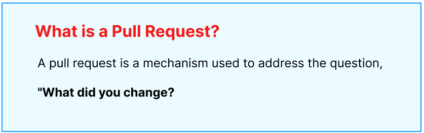

# Pull requests

## What is Pull Requests

A pull request involves submitting code contributions to a project, allowing you to share your work with other developers for review and potential integration.

> GitHub's pull requests enable users to share modifications they've made to a branch in a repository, facilitating collaboration and review. When a pull request is initiated, collaborators can engage in discussions and assess proposed changes before merging them into the main branch. This process allows for iterative refinement and ensures the integrity of the codebase.

## Workflow for a pull request

- Developer creates a new branch from the main project repository.
- Developer makes changes to the code in their branch.
- Developer pushes the changes to their branch on the remote repository (e.g., GitHub).
- Developer opens a pull request, proposing their changes to be merged into the main branch.
- Other developers review the pull request, providing feedback and suggesting improvements.
- Developer makes necessary adjustments based on feedback.
- Once the changes are approved, the pull request is merged into the main branch, incorporating the modifications into the project.

## Using Git

- **Set a Username**: `git config --gLobal user.name "<firstname Lastname>"`
- **Set an Email address**: `git config --gLobal user.email "<valid-email>"`
- **Create a Branch**: Use the command `git branch <branch-name>` to create a new branch.
- **Switch to the Branch**: Change to your new branch with `git checkout <branch-name>`
- **Stage Changes**: Add your changes to the staging area with `git add .` to include all changes, or `git add <file-name>` for specific files.
- **Commit Changes**: Commit your staged changes with `git commit -m "Your commit message"`
- **Push to Remote**: Finally, push your branch to the remote repository using `git push origin <branch-name>`
- **Display the global configuration**: `git config --global --list`
- **Initialize as a Git repository**: `git init`
- **Show modified files in working directory**: `git status`
- **Display the commit history**: `git log`
- **Add all changed files to staging area**: `git add .`
- **Commit your staged content as a new commit snapshot**: `git commit -m "<descriptive message>"`
- **To check which branch that is**: `git branch`

## Links

[About pull requests](https://docs.github.com/en/pull-requests/collaborating-with-pull-requests/proposing-changes-to-your-work-with-pull-requests/about-pull-requests)

[Pull Requests in VS Code (Youtube)](https://www.youtube.com/watch?v=LdSwWxVzUpo&t=161s)
